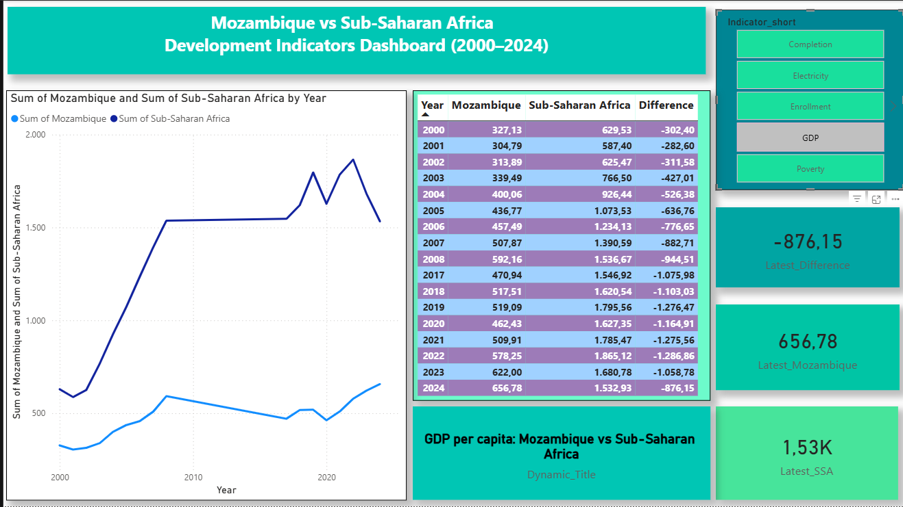

# Mozambique Development Dashboard (2000–2024)

Interactive analysis of Mozambique development indicators using R and Power BI.

## 📊 Dashboard Preview

## 📌 Overview

This project analyzes key development indicators in Mozambique with a comparative perspective against Sub-Saharan Africa.

The analysis focuses on three main pillars:
- Economic performance (GDP per capita)
- Poverty
- Education (enrollment and completion)

## 📈 Key Insights

- Mozambique shows long-term economic growth but remains below the regional average.
- Poverty has declined over time, although progress appears to slow in recent years.
- Access to education has improved significantly, but completion remains a challenge.
- Development progress is uneven across sectors.

## ⚙️ Methodology

- Data source: World Bank (World Development Indicators)
- Data cleaning and transformation performed in R
- Visualization developed in Power BI
- Analysis is descriptive (no causal inference)
- Missing data was not imputed

## 📁 Project Structure
data/
scripts/
report/
dashboard/

## 🔗 Data Source

https://data.worldbank.org/

## 👤 Author

Raimundo Cumba  
MSc in Survey Statistics and Data Analysis (ongoing)
